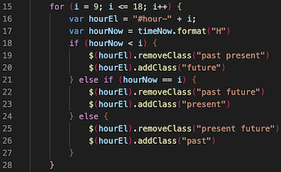

# Work Day Scheduler

This is a daily planner to organize your day.

## Simple Calendar App

Presented here is a 10 hour standard day planner. It is broken down into 10 hours of the work day for you to input your plans. When you come to this page, you will see the day followed by the hourly breakdown.

This webpage was built to sort out my hourly plans during the day. I can set my plans for each hour and it stores to remind me what I need to do. That is an amazing feature, you can refresh the page and it will show you your hourly plans!

## Usage

This is a simple to you use webpage. Click on the link below to be taken to the page. Once there, enter your plans for each specified hour. Click the flag on the right side of the page to save your plans. You can leave the site and when you come back, your plans will still be there! Plans will only update when you enter something new.

https://tylerdins88.github.io/work-day-scheduler/

The following is a screenshot that shows how I get the color of each hour to change. This changes to show wether the time is in the past, the present time, or is a future time period. 
I create a for loop that will check each time blocks ID against the current hour. If it the current hour is greater than the ID then the time is in the past. If the current hour equals the ID, you are in the present time block. Lastly, if the current hour is less than the ID, then that is a future time period. I get the current hour using day.js.

## Credits

For this project I used HTML, CSS, JavaScript, day.js, Bootstrap, and jQuery languages.

## License

MIT LICENSE